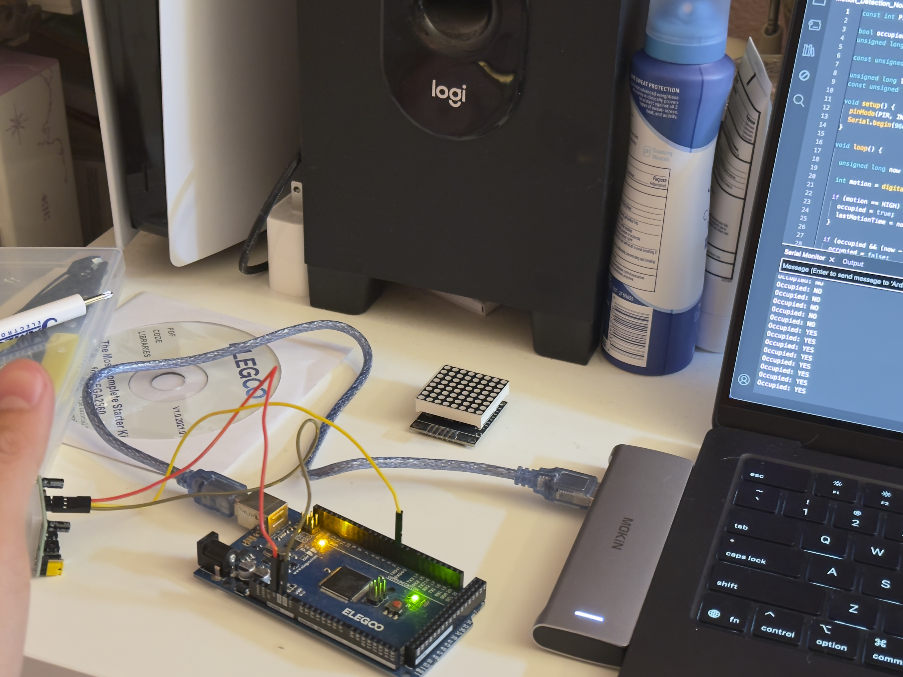

# Module 01 - Motion Detection (Occupancy State)

## Objective
Validate PIR-based occupancy detection using stable, non-blocking timing logic before integrating additional sensors or outputs.

---

## Hardware
- Arduino Mega
- HC-SR501 PIR motion sensor

---

## Inputs / Outputs

### Input
- PIR (digital): HIGH when motion is detected, LOW otherwise

### Output
- Serial Monitor debug output

---

## System Behavior
1. When PIR reads HIGH:
   - `occupied = true`
   - Last motion timestamp is updated

2. If no motion occurs for `holdTime`:
   - `occupied = false`

3. Serial output prints occupancy state at fixed intervals to avoid spam.

---

## Core Logic Concepts
- Digital signal handling
- Boolean state retention
- Non-blocking timing using `millis()`
- Event-based logic (state transitions instead of constant toggling)

---

## Validation Images

Idle State (No Motion):

Motion Detected:

---

## What This Module Demonstrates
- Stable occupancy detection
- Proper timing logic without delay()
- Foundation for multi-sensor system integration
